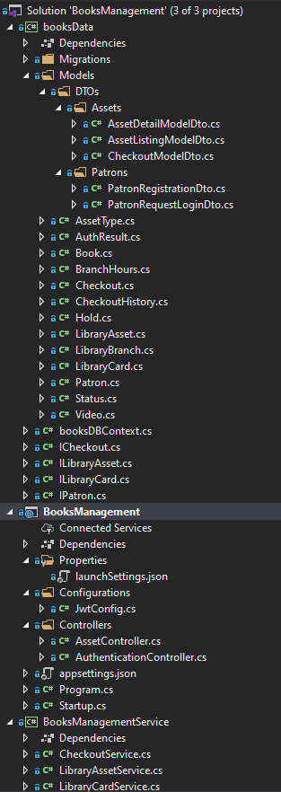
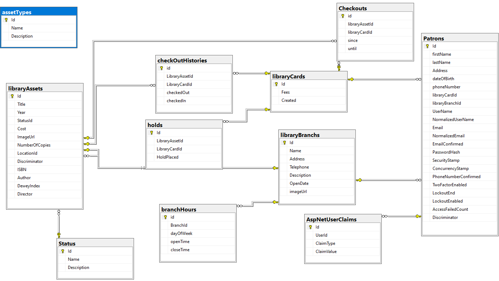

# Books Management ASP.NET CORE Reference Application
.NET CORE REST API that manage different books, video tapes and membership of patrons of library

 > **_NOTE:_**  
	The master branch is currently running ASP.NET CORE 5.0  
Multi targeted: net7.0; net6.0; net5.0; netcoreapp3.1; netcoreapp3.0; 

## Functionalities
* Library Assets  
1- Add Assets (Books, videos)  
2- Retrieve all assets that the library have  
3- Retrieve all the data related the asset such as Author or Director, DeweyIndex, Isbn, Title and Type  
4- Remove a specific library Asset

* Checkouts  
1- Placing checkouts on a library asset 
2- Getting the checkout history on a library asset  
3- Remove checkouts for a library asset 
4- close the checkout history 
5- Checking a library Asset 
6- placing hold on a library Asset  
7- Get the current Checkout of a patron 
8- Get checkout by asset 
9- Retrieving all the current holds and checkouts on a library asset for a patron 
10- Mark a library asset either Found or Lost 

* Patron  
1- Add a patron to the library 
2- Retrieve the patrons that are currently subscribed to the library  
3- Retrieve all the holds and checkouts that are placed by a patron on a specefic library asset  

# Authorization and authentication process
JSON Web Token (JWT) is an open standard (RFC 7519) that defines a compact and self-contained way for securely transmitting information between parties as a JSON object. This information can be verified and trusted because it is digitally signed. JWTs can be signed using a secret (with the HMAC algorithm) or a public/private key pair using RSA or ECDSA.
[Read About it](https://jwt.io/introduction)  

## Architecture of the app

## Database representation of the app

# How to test the API
* By using PostMan:
	[Read about it](https://www.postman.com/)
* By using Swagger:
	Its pre-configured in this project as soon as you execute the app swagger will be prompted to you in your browser [Read About it](https://swagger.io/) 

	
	

